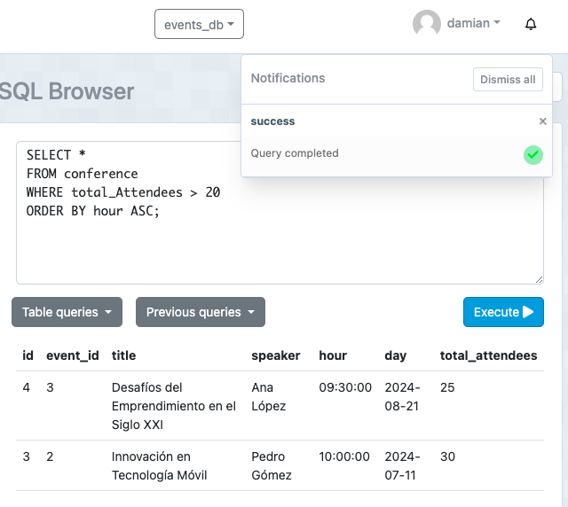

# Tarea TAS7 - Events

Damian Olivo

## 1. Consulta para seleccionar todos los eventos en Cuenca, ordenados por la cantidad total de asistentes en orden descendente.

  - Sentencia:
  ```
  SELECT *
  FROM event
  WHERE city = 'Cuenca'
  ORDER BY total_Attendees DESC;
  ```
  - Captura:


## 2. Consulta para seleccionar todas las conferencias que tengan más de 20 asistentes, ordenadas por la hora en orden ascendente.
  - Sentencia:
  ```
  SELECT *
  FROM conference
  WHERE total_Attendees > 20
  ORDER BY hour ASC;
  ```
  - Captura:



## 3. Consulta para seleccionar todos los miembros que tienen más de 30 años, ordenados por nombre completo en orden ascendente.

  - Sentencia:
  ```
  SELECT *
  FROM member
  WHERE age > 30
  ORDER BY full_name ASC;
  ```
  - Captura:


## 4. Consulta para seleccionar todos los registros donde los asistentes han asistido, ordenados por la fecha de registro en orden descendente.
  - Sentencia:
  ```
SELECT *
FROM register
WHERE assited = TRUE
ORDER BY registered_at DESC;
  ```
  - Captura:


## 5. Consulta para seleccionar todas las conferencias del evento con id 1, ordenadas por el título de la conferencia en orden ascendente.
  - Sentencia:
  ```
SELECT *
FROM conference
WHERE event_id = 1
ORDER BY title ASC;
  ```
  - Captura:

